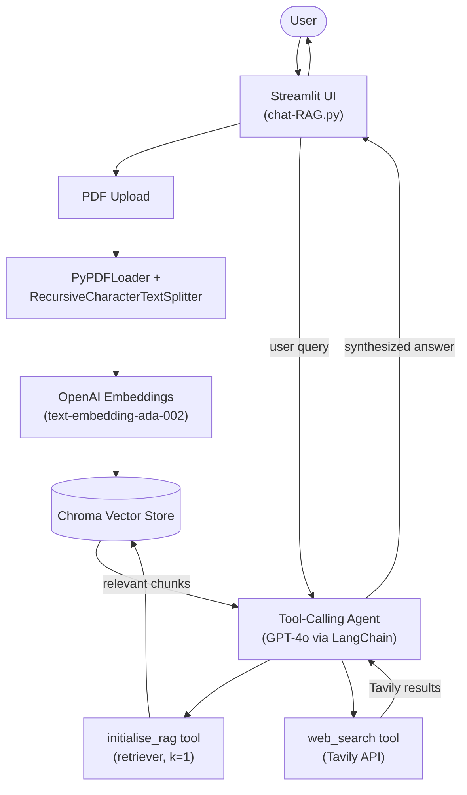

# Uploadable RAG Chat

Upload a PDF, ask questions about it, and get answers that combine your document's content with live web search — powered by LangChain, OpenAI, ChromaDB, and Tavily, wrapped in a Streamlit UI.

**Live app:** [https://upload-rag.onrender.com](https://upload-rag.onrender.com)

## System Architecture



**Flow summary:**
1. User uploads a PDF via the Streamlit UI.
2. The document is split into chunks and embedded, then stored in an in-memory Chroma vector store.
3. When the user asks a question, a LangChain tool-calling agent (GPT-4o) decides whether to query the internal vector store, the web (via Tavily), or both.
4. The agent synthesizes internal and external results into a single, cited answer displayed back in the chat UI.

## Installation Guide

### Prerequisites
- Python 3.11+ (see `.python-version`)
- An [OpenAI API key](https://platform.openai.com/api-keys)
- A [Tavily API key](https://tavily.com/)

### 1. Clone the repository
```bash
git clone <your-repo-url>
cd chromaDB-uploadableRAG
```

### 2. Create a virtual environment
```bash
python -m venv .venv
source .venv/bin/activate   # on Windows: .venv\Scripts\activate
```

### 3. Install dependencies
```bash
pip install -r requirements.txt
```

### 4. Configure environment variables
Create a `.env` file in the project root:
```bash
OPENAI_API_KEY=your_openai_api_key
TAVILY_API_KEY=your_tavily_api_key
```

### 5. Run the app locally
```bash
streamlit run chat-RAG.py
```
The app will open at `http://localhost:8501`.

### 6. Try it online
No setup needed — use the hosted version at **[upload-rag.onrender.com](https://upload-rag.onrender.com)**.
